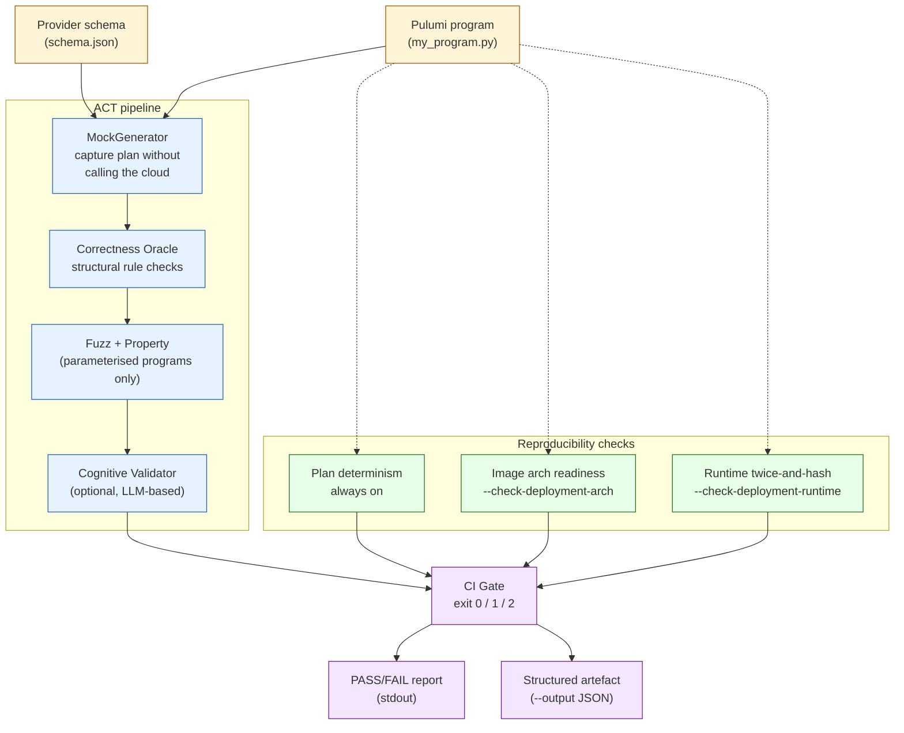

# ACT: Automated Configuration Testing

A validation gate for Pulumi infrastructure-as-code. ACT intercepts resource declarations before they hit the cloud, checks them against security rules, exercises them under fuzz/property variations, and verifies they deploy reproducibly across a fleet of CPU and accelerator targets.

ACT is designed to run as a CI/CD gate: every commit is validated; bad programs exit non-zero and block deployment.

---

## Table of contents

1. [Quick start](#quick-start)
2. [What ACT does](#what-act-does)
3. [CLI reference](#cli-reference)
4. [Examples](#examples)
5. [CI/CD integration](#cicd-integration)
6. [Writing programs ACT can validate](#writing-programs-act-can-validate)
7. [Supported providers](#supported-providers)
8. [Extending ACT](#extending-act)
9. [Architecture](#architecture)
10. [Reproducibility checks](#reproducibility-checks)
11. [Troubleshooting](#troubleshooting)

---

## Quick start

```bash
# 1. Clone + install
git clone https://github.com/HIRO-MicroDataCenters-BV/act.git
cd act
git submodule update --init --recursive
uv sync

# 2. Validate a sample program (the schema is auto-resolved from its imports)
uv run act check --program tests/fixtures/cape/path_a_valid.py

# Expected:
# PASS  tests/fixtures/cape/path_a_valid.py
# Summary: 2 resources, 0 violations, plan reproducible
# (exit 0)
```

Try the negative case:

```bash
uv run act check --program tests/fixtures/cape/path_a_invalid.py

# Expected:
# FAIL  tests/fixtures/cape/path_a_invalid.py
#   [HIGH] spec.securityGroupRef: Instance has no security group - network traffic is uncontrolled
#   [HIGH] spec.sshKeys: SSH keys configured but no security group - SSH access is open
# Summary: 1 resource, 2 violations, plan reproducible
# (exit 1)
```

That's the gate. Wire the same invocation into CI and bad commits stop at the gate instead of at the cloud.

---

## What ACT does

For every Pulumi program you run through it, ACT does up to five things:

1. **Captures the plan without provisioning.** It hooks the Pulumi SDK and records what resources *would* be created and what inputs they carry. Never calls a real cloud API.
2. **Checks structural rules.** The oracle flags missing required fields (for example a missing security group), wrong types, and out-of-range or invalid enum values, plus provider rules such as CAPE network exposure. Each surfaces as a `Violation` with severity and a recommendation. Content checks (embedded secrets) are the cognitive validator's job.
3. **Fuzzes parameterised programs.** When the program takes inputs, ACT mutates them (atheris fuzz + hypothesis property tests) to find configurations that pass the type checker but break the policy.
4. **Verifies reproducibility.** Optional: re-runs the program against an ephemeral cluster (k3s in Docker) twice and confirms the deployed state hashes identically. Covers amd64, arm64, riscv64, GPU, FPGA, and CXL targets.
5. **Offers AI advice.** Optional: with the cognitive validator enabled, ACT sends the program to an LLM for extra security advice. The findings are advisory by default and don't change the pass/fail result unless you opt into `--acv-mode blocking`.

### Architecture and flow



Solid arrows are the core validation pipeline; dotted arrows are the reproducibility checks (plan determinism always runs; the arch and runtime checks are opt-in). The CI gate maps the combined result to an exit code that any CI system can act on.

Exit codes:

| Code | Meaning |
|------|---------|
| 0 | All checks passed |
| 1 | One or more violations found |
| 2 | Pipeline error (bad schema, program crash, missing tooling) |

---

## CLI reference

ACT installs an `act` console command (via `uv sync`). The canonical invocation is
`uv run act check ...`. The older `uv run python -m act.run ...` and the Docker
image's `python -m act.run` entrypoint remain supported and behave identically. A
bare `act --program ...` with no subcommand also runs `check`.

| Command | Purpose |
|---------|---------|
| `act check` | Validate a program (the default when no command is given) |
| `act doctor` | Report external-tool availability and per-flag prerequisites |
| `act list-rules` | List the security rules ACT applies |
| `act list-providers` | List providers ACT has built-in rules for |
| `act version` | Print the ACT version (also `act --version` / `-V`) |

Flags for `act check`:

| Flag | Required | Default | Description |
|------|----------|---------|-------------|
| `--program PATH` | yes | none | Path to the Pulumi program file (or project directory) |
| `--schema PATH [PATH ...]` | no | auto | Provider schema JSON. Omit to auto-resolve one per provider from the program's `pulumi_*` imports (local `<plugin>.json` or `pulumi get-schema`); pass explicitly (repeatable) to override. |
| `--schema-dir DIR` | no | none | Extra directory to search for a local `<plugin>.json` during auto-resolution. Repeatable. Use it for custom or in-house providers that have no public plugin |
| `--config PATH` | no | `./act.toml` | Path to an `act.toml` config file. Precedence per field: CLI flags > env > file > default |
| `--quiet` | no | off | Suppress the one-line `Summary:` footer (the PASS/FAIL report still prints) |
| `--output DIR` | no | none | Write a structured run artefact (JSON) to this directory |
| `--log-level LEVEL` | no | `WARNING` | One of `DEBUG`, `INFO`, `WARNING`, `ERROR`. Env: `ACT_LOG_LEVEL` |
| `--rules ENGINE [ENGINE ...]` | no | none | Load an additional rule engine. Currently: `checkov` (100+ Kubernetes checks) |
| `--check-deployment-arch ARCH` | no | off | Smoke-boot every container image referenced by the program under `linux/<ARCH>` via QEMU. Example: `--check-deployment-arch riscv64` |
| `--check-deployment-runtime` | no | off | Provision an ephemeral k3s cluster matching the program's target, run `pulumi up` twice, and verify the deployed state hashes identically. Requires `docker`, `kubectl`, and `pulumi` CLI |
| `--acv-mode {advisory,blocking}` | no | `advisory` | Whether the cognitive validator's verdict gates the exit code. `advisory` (default) never blocks; `blocking` fails the gate on an ACV FAIL. Env: `ACT_ACV_MODE` |

The optional cognitive validator has no flag of its own; it is enabled through environment variables:

| Variable | Purpose |
|----------|---------|
| `ACT_ACV_MODEL` | Served model id for the optional cognitive validator |
| `ACT_ACV_BASE_URL` | Base URL of an OpenAI-compatible endpoint (for example `http://localhost:8000/openai/v1`). Legacy alias: `CAPE_ACV_MODEL_URL` |
| `ACT_ACV_API_KEY` | Optional bearer token for a hosted endpoint (omit for an unauthenticated local server) |
| `ACT_ACV_TIMEOUT` | Optional per-request timeout in seconds (default 20; raise it for slower or reasoning models) |
| `ACT_ACV_EXTRA_BODY` | Optional JSON object merged into every chat-completions request body, for endpoint-specific fields. Example: `{"chat_template_kwargs":{"enable_thinking":false}}` to turn off Qwen3 thinking. Invalid JSON is ignored with a warning |

Both must be set, and the `acv` extra installed (`uv sync --extra acv`), for the validator to run; otherwise it is skipped.

Other environment variables are all read in `act/config.py`; a missing, blank, or
out-of-range value falls back to the default with a warning. Any of them can also be
set in `act.toml` using the field name without the `ACT_` prefix (e.g. `log_level =
"INFO"`), with precedence CLI > env > file.

Logging and analysis depth:

| Variable | Purpose | Default |
|----------|---------|---------|
| `ACT_LOG_LEVEL` | Default log verbosity when `--log-level` is not passed | `WARNING` |
| `ACT_ACV_MAX_ITERATIONS` | Cognitive validator planner/tool loop iterations | `3` |
| `ACT_ACV_MIN_REQUEST_INTERVAL_S` | Minimum seconds between ACV LLM calls; pace to a free-tier RPM limit | `0` (no pacing) |
| `ACT_ACV_MAX_RETRIES` | Retries on rate-limit/overload (429/5xx) responses from the LLM | `3` |
| `ACT_FUZZ_ITERATIONS` | Fuzz mutations per resource on Path B (parameterized programs) | `100` |
| `ACT_PROPERTY_MAX_EXAMPLES` | Hypothesis examples per resource on Path B | `50` |

Reproducibility substrate images:

| Variable | Purpose | Default |
|----------|---------|---------|
| `ACT_K3S_IMAGE` | k3s image for the amd64, arm64, GPU, FPGA, and CXL runtime substrates | `rancher/k3s:v1.32.1-k3s1` |
| `ACT_K3S_RISCV64_IMAGE` | k3s image for the riscv64 runtime substrate | `ghcr.io/carv-ics-forth/k3s:v1.32.1-k3s1-riscv64` |

Reproducibility target and timeouts (used by `--check-deployment-runtime` / `--check-deployment-arch`):

| Variable | Purpose | Default |
|----------|---------|---------|
| `ACT_K8S_NAMESPACE` | Namespace the runtime probe reads the deployed workload from | `default` |
| `ACT_RUNTIME_ARCHS` | Comma-separated subset of `amd64,arm64,riscv64` to include in the substrate registry | all three |
| `ACT_K3S_API_HOST_PORT` | Host port mapped to the k3s API server | `6443` |
| `ACT_K3S_STARTUP_TIMEOUT_S` | Seconds to wait for k3s to come up (raise for QEMU/slow CI) | `180` |
| `ACT_IMAGE_BOOT_TIMEOUT_S` | Seconds to wait for each image to smoke-boot under QEMU | `60` |
| `ACT_K8S_API_READY_TIMEOUT_S` | Seconds to wait for node registration before patching Extended Resources | `60` |
| `ACT_K8S_PROBE_TIMEOUT_S` | Timeout for the kubectl probe of deployed state | `60` |

Accelerator Extended Resources:

| Variable | Purpose | Default |
|----------|---------|---------|
| `ACT_K8S_GPU_RESOURCE_NAME` | Extended Resource declared by the GPU substrate | `nvidia.com/gpu` |
| `ACT_K8S_FPGA_RESOURCE_NAME` | Extended Resource declared by the FPGA substrate | `cape.eu/fpga` |
| `ACT_K8S_CXL_RESOURCE_NAME` | Extended Resource declared by the CXL substrate | `cape.eu/cxl` |
| `ACT_ACCELERATOR_COUNT` | Quantity of the Extended Resource advertised on the node | `1` |

Show the help text:

```bash
uv run act --help          # command overview
uv run act check --help    # all check flags
uv run act doctor          # verify prerequisites for the optional checks
```

---

## Examples

### Validate a CAPE program

```bash
uv run act check \
    --program tests/fixtures/cape/path_a_valid.py \
    --schema tests/fixtures/cape/schema.json
```

### Validate a Kubernetes program

```bash
uv run act check \
    --program tests/fixtures/kubernetes/nginx_deployment.py \
    --schema examples/kubernetes/schema.json
```

### Validate a multi-provider program (CAPE + random)

ACT resolves one schema per provider the program imports, so a program using
several providers needs no special handling. Omit `--schema` to auto-resolve
each provider independently (each via a local `<plugin>.json` or `pulumi package
get-schema`):

```bash
uv run act check --program my_program.py
```

Or pass every schema explicitly to override resolution for the whole program:

```bash
uv run act check \
    --program my_program.py \
    --schema tests/fixtures/cape/schema.json tests/fixtures/random/schema.json
```

### Add Checkov rules on top of the built-in oracle

```bash
uv run act check \
    --program tests/fixtures/kubernetes/nginx_deployment.py \
    --schema examples/kubernetes/schema.json \
    --rules checkov
```

### Validate with the cognitive validator (optional AI advice)

```bash
uv sync --extra acv
export ACT_ACV_MODEL=<served-model-id>
export ACT_ACV_BASE_URL=http://localhost:8000/openai/v1
uv run act check \
    --program tests/fixtures/cape/path_a_invalid.py \
    --schema tests/fixtures/cape/schema.json
```

The report gains an `ACV (advisory)` block with the model's suggestions.

### Check that every image in the program can boot under riscv64

```bash
uv run act check \
    --program tests/fixtures/kubernetes/nginx_deployment.py \
    --schema examples/kubernetes/schema.json \
    --check-deployment-arch riscv64
```

### Full reproducibility check on a real ephemeral cluster

```bash
uv run act check \
    --program tests/fixtures/kubernetes/configmap.py \
    --schema examples/kubernetes/schema.json \
    --check-deployment-runtime \
    --output ./act_runs
```

The `--output` directory will contain `act_run_<TIMESTAMP>.json` with plan-check, arch-check, and runtime-check results, plus the package versions used. Useful for audit.

### Get JSON logs for a log aggregator

```bash
uv run act check \
    --program my_program.py --schema schema.json \
    --log-level INFO 2>&1 1>/dev/null | jq .
```

JSON goes to stderr; the human-readable PASS/FAIL report goes to stdout. The two streams are independent, so you can pipe or redirect them separately.

---

## CI/CD integration

ACT exits 0/1/2. Wire it into any pipeline that respects exit codes.

### GitHub Actions

```yaml
# .github/workflows/act.yml
name: ACT validation
on: [push, pull_request]

jobs:
  validate:
    runs-on: ubuntu-latest
    steps:
      - uses: actions/checkout@v4
        with:
          submodules: recursive

      - uses: astral-sh/setup-uv@v3
      - run: uv sync --frozen

      # Optional: register QEMU binfmt for --check-deployment-arch
      - uses: docker/setup-qemu-action@v3

      - name: Validate IaC
        run: |
          uv run act check \
            --program infra/main.py \
            --schema schemas/cape.json schemas/kubernetes.json \
            --check-deployment-arch riscv64 \
            --output ./act_runs

      - uses: actions/upload-artifact@v4
        if: always()
        with:
          name: act-runs
          path: ./act_runs/
```

### GitLab CI

```yaml
# .gitlab-ci.yml
act:
  image: ghcr.io/astral-sh/uv:python3.11
  variables:
    GIT_SUBMODULE_STRATEGY: recursive
  script:
    - uv sync --frozen
    - uv run act check --program infra/main.py --schema schemas/cape.json
  artifacts:
    when: always
    paths: [act_runs/]
```

### Jenkins

```groovy
pipeline {
  agent any
  stages {
    stage('ACT') {
      steps {
        sh '''
          uv sync --frozen
          uv run act check --program infra/main.py --schema schemas/cape.json
        '''
      }
    }
  }
}
```

### Docker

A pre-built image is published per release. `latest` tracks the newest; pin a release tag (e.g. `:0.5.1`) for reproducible runs. The image expects the program + schema on a mounted volume.

```bash
docker run --rm \
  -v "$PWD/infra:/work" \
  ghcr.io/hiro-microdatacenters-bv/act:latest \
  --program /work/main.py --schema /work/schemas/cape.json
```

### Kubernetes

A Helm chart ships in `charts/act/`. It runs ACT as a one-shot `Job`:

```bash
helm install act ./charts/act \
  --set program=/workspace/program.py \
  --set schema=/workspace/schema.json
```

`program` and `schema` are the in-container paths ACT reads. Mount the actual files at those paths via the chart's `volumes` / `volumeMounts` values (or a configMap / init container), as noted in `charts/act/values.yaml`.

The in-cluster Job runs the plan-time checks only (mock generation, oracle, and the cognitive validator when reachable). The reproducibility flags (`--check-deployment-arch`, `--check-deployment-runtime`) are not exposed by the chart: they need `docker`/`kubectl`/`pulumi` and privileged host access, which suits a workstation or CI runner, not a pod inside the validated cluster. Run them from CI or locally with `uv run act check`.

---

## Writing programs ACT can validate

ACT accepts any standard Pulumi Python program. No special imports, no decorators.

### Two flavours

**LLM-generated programs (Path A)**: hard-coded inputs, no parameters. ACT runs the mock generator + oracle + (optionally) the cognitive validator.

```python
# valid_instance.py
from pulumi_cape.compute import Instance
from pulumi_cape.schemas import InstanceSpecArgs, ReferenceArgs, VolumeReferenceArgs

Instance("web",
    spec=InstanceSpecArgs(
        boot_volume=VolumeReferenceArgs(device_ref=ReferenceArgs(resource="volumes/boot")),
        sku_ref=ReferenceArgs(resource="skus/medium"),
        zone="zone-1",
        security_group_ref=ReferenceArgs(resource="security-groups/web"),
    ),
    workspace="default",
)
```

**Developer-written programs (Path B)**: read inputs from `os.environ` / `sys.argv`. ACT additionally fuzzes those inputs and runs hypothesis property tests to explore corners that pass typing but fail policy.

```python
# parameterised.py
import os

from pulumi_cape.compute import Instance
from pulumi_cape.schemas import InstanceSpecArgs, ReferenceArgs, VolumeReferenceArgs

Instance("web",
    spec=InstanceSpecArgs(
        boot_volume=VolumeReferenceArgs(device_ref=ReferenceArgs(resource="volumes/boot")),
        sku_ref=ReferenceArgs(resource=f"skus/{os.environ.get('CAPE_SKU', 'medium')}"),
        zone=os.environ.get("CAPE_ZONE", "zone-1"),
        security_group_ref=ReferenceArgs(resource="security-groups/web"),
    ),
    workspace="default",
)
```

### Rules

- Use provider SDK classes normally (`from pulumi_cape.compute import Instance`).
- Use `pulumi.export(...)` to expose outputs; ACT captures them too.
- Do NOT call external APIs or read live cloud state inside the program. ACT runs the program in a sandboxed mock environment; live calls will be intercepted or fail.

---

## Supported providers

ACT is provider-agnostic and works with any Pulumi provider's schema. The repo ships ready-to-run schemas + fixtures for:

| Provider | Schema location |
|----------|-----------------|
| CAPE | `tests/fixtures/cape/schema.json` |
| Kubernetes | `examples/kubernetes/schema.json` |
| pulumi-random | `tests/fixtures/random/schema.json` |

For any other Pulumi provider:

```bash
pulumi package get-schema <provider-name> > schemas/<provider>.json
uv run act check --program my_program.py --schema schemas/<provider>.json
```

---

## Extending ACT

Two extension points in `act/plugins/base.py`.

### Custom oracle rules

To add rules to the built-in oracle without replacing it, drop a file in `act/rules/<provider>.py` with a `register(oracle)` function:

```python
# act/rules/myprovider.py
from act.core.violations import Violation

def rule_no_public_endpoint(inputs):
    if inputs.get("public"):
        return [Violation(field="public", message="Public endpoints are forbidden", severity="HIGH")]
    return []

def register(oracle):
    oracle.add_rule(rule_no_public_endpoint, resource_type="myprovider:net/v1:Service")
```

Rules auto-load by file name on startup.

To replace the oracle entirely, subclass `OraclePlugin`:

```python
from act.plugins.base import OraclePlugin
from act.core.violations import Violation

class MyOracle(OraclePlugin):
    def check(self, resource_type: str, inputs: dict) -> list[Violation]:
        return []
```

### Custom test generators

Subclass `TestGeneratorPlugin` to inject a mutation strategy beyond the built-in fuzz and property runners:

```python
from act.plugins.base import TestGeneratorPlugin
from act.core.violations import Violation

class MyGenerator(TestGeneratorPlugin):
    def run(self, program_path: str) -> list[Violation]:
        # mutate program inputs, run the pipeline, collect violations
        return []
```

Custom generators only run on parameterised programs.

---

## Architecture

```
act/
  core/
    mock_generator.py     # Pulumi SDK interception; produces a captured plan
    oracle.py             # Pluggable rule engine
    violations.py         # Violation dataclass
    fuzz_runner.py        # atheris-based fuzz runner (parameterised programs)
    property_runner.py    # hypothesis-based property tests (parameterised programs)
    pipeline.py           # Wires everything together
  rules/
    cape.py               # CAPE security rules (security_group_ref, ssh_keys, ...)
  integrations/
    checkov_adapter.py    # Optional Checkov rule engine
  acv/                    # Cognitive validator (LangGraph + LLM tools)
  gate/
    ci_gate.py            # Exit-code mapping, structured report
  plugins/
    base.py               # OraclePlugin + TestGeneratorPlugin ABCs
  reproducibility/
    plan_check.py         # Same-program-twice plan hashing
    deployment_arch.py    # Per-image arch smoke-boot
    runtime_check.py      # Substrate-driven twice-and-hash on a real cluster
    substrates/           # DockerSubstrate (CPU) + AcceleratorSubstrate (GPU/FPGA/CXL)
    artefact.py           # JSON-per-run artefact writer
  run.py                  # CLI entry point
```

Design decisions worth knowing:

- **Provider-agnostic by construction.** No provider is hardcoded; the mock generator reads any Pulumi schema and works.
- **Oracle is structural.** Missing fields, wrong types, policy violations. Content analysis (shell-command-in-`user_data`, embedded secrets) is the cognitive validator's job.
- **The cognitive validator is optional.** For AI-assisted advice on top of the deterministic checks, install the `acv` extra (`uv sync --extra acv`) and set `ACT_ACV_MODEL` and `ACT_ACV_BASE_URL` to an OpenAI-compatible LLM endpoint (for example a vLLM server).
- **Logging is two-stream.** Structured JSON on stderr, human PASS/FAIL report on stdout.
- **Plugins are stable.** `OraclePlugin` and `TestGeneratorPlugin` are the two extension points; everything else is internal.

---

## Reproducibility checks

ACT verifies your IaC is deterministic at three levels. Each is opt-in (except plan check, which always runs).

### 1. Plan determinism (always on)

Runs your program twice on the host with the mock generator, hashes the canonical-JSON output, compares. Catches programs that produce different plans on repeated invocations (random suffixes, time-dependent generators, env-dependent values).

### 2. Image arch readiness (`--check-deployment-arch <arch>`)

For every container image referenced by your program, runs `docker run --platform linux/<arch> --entrypoint /bin/true <image>`. Catches images that lack an arch variant or fail to start under QEMU.

### 3. Runtime reproducibility (`--check-deployment-runtime`)

Provisions an ephemeral k3s cluster in Docker, runs `pulumi up` against it twice, hashes the deployed state across runs. Catches non-deterministic deployments that survive the host-side plan check (random pod-name suffixes, env-leak into ConfigMap data, time-of-day branches in IaC).

The substrate registry covers six target classes:

| Target | How it works |
|--------|--------------|
| **amd64** | `rancher/k3s` upstream image |
| **arm64** | `rancher/k3s` upstream image (native on Apple Silicon, otherwise via QEMU) |
| **riscv64** | A pinned k3s build with bundled bridge CNI, runs under QEMU `binfmt_misc` |
| **GPU** | k3s + declares `nvidia.com/gpu` as a schedulable Extended Resource on the node, so GPU-aware programs schedule correctly. Validates the IaC layer; real CUDA execution needs a GPU on the host |
| **FPGA** | k3s + `cape.eu/fpga` Extended Resource + iverilog workload image. Boot-flow simulator's `$display` output is captured and hashed for byte-equal comparison across runs |
| **CXL** | k3s + `cape.eu/cxl` Extended Resource + QEMU-in-Pod workload image. Boots a Linux 6.8 guest with a `cxl-type3` memory device; the `cxl list -v` topology JSON is captured and hashed |

The substrate is selected automatically from the program's target architecture and declared resource needs (`nvidia.com/gpu`, `cape.eu/fpga`, `cape.eu/cxl`). To force a specific substrate from the CLI, pass `--check-deployment-runtime` and ACT picks the matching row.

---

## Troubleshooting

| Symptom | Likely cause + fix |
|---------|--------------------|
| `ModuleNotFoundError: No module named 'pulumi_cape'` | The `cape-sdks/` submodule isn't initialised. Run `git submodule update --init --recursive` |
| `FileNotFoundError: schema.json` | Either the path is wrong, or you haven't fetched the schema. Run `pulumi package get-schema <provider> > schemas/<provider>.json` |
| `--check-deployment-arch riscv64` exits with `docker_missing` | Docker isn't on PATH. Install Docker Desktop or `docker.io` |
| Image arch check fails with `no_arch_variant` | The image's manifest list doesn't include the target arch. Either rebuild the image multi-arch (`docker buildx build --platform linux/amd64,linux/arm64,linux/riscv64`), or remove the target arch from your validation matrix |
| `--check-deployment-runtime` exits with `substrate_unavailable` | One of `docker`, `kubectl`, or `pulumi` CLI isn't on PATH. Install all three |
| `--check-deployment-runtime` for the FPGA/CXL targets is skipped | The workload image (`act-fpga:iverilog`, `act-cxl:qemu`) isn't built locally. Run `bash tests/integration/fpga/build.sh` or `bash tests/integration/cxl/build.sh` to build it |
| Pulumi `pip list` fails inside the runtime check | The Python venv ACT is running in needs `pip` installed. Run `uv pip install pip` once |
| Exit code 2 with `Pipeline failed: ...` | Programmatic error in the Pulumi program itself, or a schema parse failure. Re-run with `--log-level DEBUG` to see the full traceback |

---

## Logging

```bash
# Silent (default): only the PASS/FAIL report on stdout
uv run act check ...

# INFO: one JSON line per pipeline stage with duration_ms
uv run act check ... --log-level INFO

# DEBUG: every oracle call, every fuzz/property entry/exit
uv run act check ... --log-level DEBUG
```

Example INFO output (stderr):

```json
{"level": "INFO", "logger": "act.core.pipeline", "msg": "pipeline.start", "program": "main.py", "parameterized": false}
{"level": "INFO", "logger": "act.core.pipeline", "msg": "pipeline.mock_done", "resources": ["web"], "duration_ms": 28}
{"level": "INFO", "logger": "act.core.pipeline", "msg": "pipeline.oracle_done", "violations": 2, "duration_ms": 0}
{"level": "INFO", "logger": "act.gate.ci_gate", "msg": "ci_gate.result", "passed": false, "violations": 2, "exit_code": 1}
```

Pipe the JSON to `jq` (stderr) and keep the report on stdout:

```bash
uv run act check ... --log-level INFO 2> >(jq .) > report.txt
```

---

## License

ACT is released under the Apache License 2.0. See [`LICENSE`](LICENSE) and [`NOTICE`](NOTICE) for the full terms.
